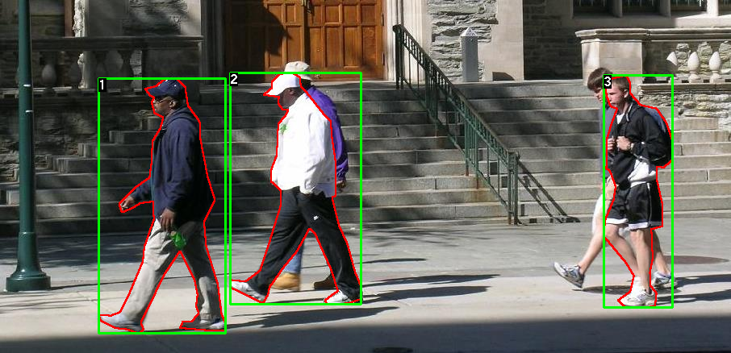

# Mask R-CNN

## What is Mask R-CNN

Mask R-CNN is a Convolutional Neural Network (CNN) and state-of-the-art in terms of [image segmentation](https://viso.ai/deep-learning/image-segmentation-using-deep-learning/). This variant of a [Deep Neural Network](https://viso.ai/deep-learning/deep-neural-network-three-popular-types/) detects objects in an image and generates a high-quality segmentation mask for each instance. 

Here is one example of a pair of images and segmentation masks.

> Example from [TorchVision Object Detection Finetuning Tutorial](https://pytorch.org/tutorials/intermediate/torchvision_tutorial.html) from PyTorch
> 

## What is R-CNN

The term R-CNN or RCNN, stands for Region-Based Convolutional Neural Network, it is a type of machine learning model that is used for computer vision tasks, specifically for object detection.

## How to implement the Mask R-CNN in PyTorch

Here are some resources about training Mask R-CNN in PyTorch.

- [Train Mask R-CNN Net for Object Detection in 60 Lines of Code](https://towardsdatascience.com/train-mask-rcnn-net-for-object-detection-in-60-lines-of-code-9b6bbff292c3)
- [TorchVision Object Detection Finetuning Tutorial](https://pytorch.org/tutorials/intermediate/torchvision_tutorial.html)

**Acknowledgement :** The content of this document has been adapted from this original [Mask R-CNN : A Beginner’s Guide](https://viso.ai/deep-learning/mask-r-cnn/#:~:text=Mask%20R%2DCNN%20is%20a,segmentation%20mask%20for%20each%20instance.).

